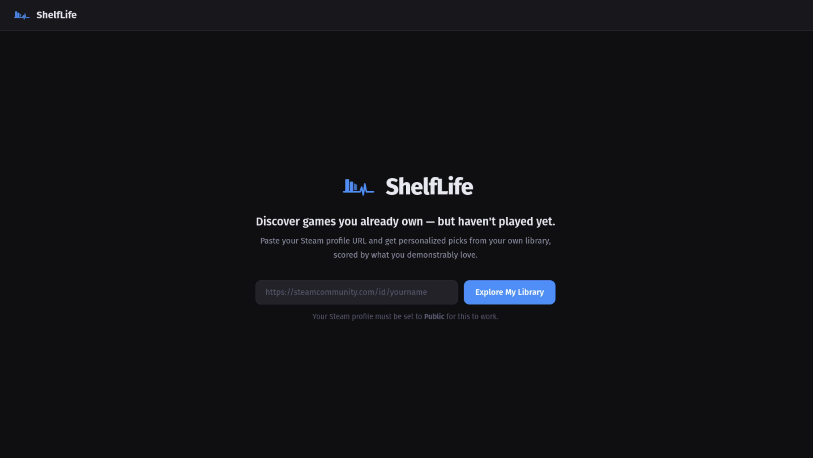
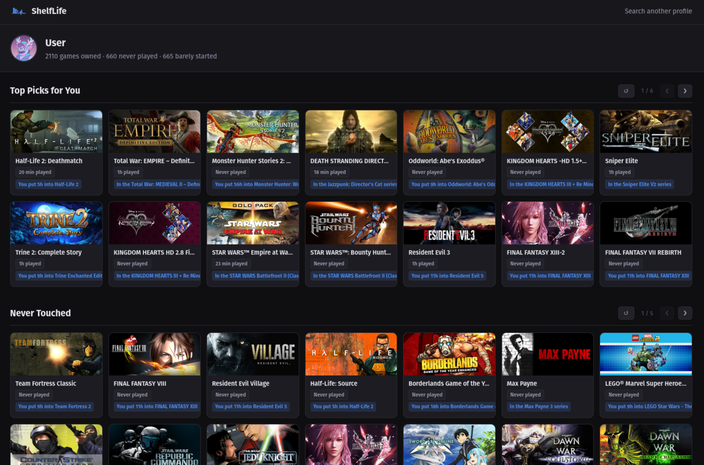

# ShelfLife

<p align="center">
  <br/>
  <strong>Discover games you already own — but haven't played yet.</strong>
</p>

ShelfLife connects to your Steam library and surfaces personalized picks from your backlog, scored by what you demonstrably love. No ads, no recommendations to buy new games — just your shelf, filtered by taste.

### Home



### Profile



## Features

- **Top Picks** — scored recommendations based on your playtime patterns, tags, developers, and Steam reviews
- **Never Touched** — games you own but have zero playtime
- **Almost Started** — games with under 30 minutes played
- **By Genre** — browse your backlog filtered by genre
- **Detail Modal** — game art, trailer video (Steam HLS or YouTube fallback), ratings, tags, and why it was recommended
- **Personalized reasons** — "Because you loved X", "More from Y (you loved Z)", franchise detection
- **Mobile friendly** — responsive layout down to 320px

## Tech Stack

- **Runtime**: Node.js 20
- **Framework**: Express + EJS
- **Database**: SQLite via better-sqlite3 (metadata cache, library cache, rec cache)
- **APIs**: Steam Web API, SteamSpy, Steam Store appdetails, YouTube Data API v3
- **Video**: HLS.js for Steam HLS trailers; YouTube iframe embed as fallback for games with no Steam trailer
- **Auth**: Session-based (no login required — just paste your Steam profile URL)

## Setup

### Prerequisites

- Node.js 20+
- A [Steam Web API key](https://steamcommunity.com/dev/apikey)
- A [YouTube Data API v3 key](https://console.cloud.google.com/) (optional but recommended — used as a trailer fallback for older games that Steam has no trailer for)

### Install

```bash
git clone https://github.com/Lebbitheplow/shelflife.git
cd shelflife
npm install
cp .env.example .env
```

Edit `.env` with your values:

```env
STEAM_API_KEY=your_steam_web_api_key_here
SESSION_SECRET=change_this_to_a_random_string
PORT=3233
YOUTUBE_API_KEY=your_youtube_data_api_v3_key_here
```

### Run

```bash
# Production
npm start

# Development (auto-restarts on file changes)
npm run dev
```

Then visit `http://localhost:3233` and paste your Steam profile URL.

## How It Works

1. You enter a Steam profile URL or custom ID
2. ShelfLife fetches your owned games via the Steam Web API
3. Metadata (tags, genres, ratings, trailers) is pulled from SteamSpy and the Steam Store API and cached locally
4. Your positively-reviewed games are fetched and weighted 1.5x in scoring
5. A preference profile is built from your playtime: tag weights, developer weights, franchise signals
6. Every unplayed/barely-played game is scored against that profile
7. Results are cached for 6 hours — subsequent visits load instantly

## Configuration

| Variable | Description |
|---|---|
| `STEAM_API_KEY` | Steam Web API key (required) |
| `SESSION_SECRET` | Random string for signing session cookies |
| `PORT` | Port to listen on (default: 3233) |
| `YOUTUBE_API_KEY` | YouTube Data API v3 key (optional) — falls back to YouTube search for games with no Steam trailer. Requires an **IP address** restriction (not HTTP referrer) since requests are made server-side. |

## Notes

- Your Steam profile must be set to **Public** for the library fetch to work
- First visit may take 1–2 minutes for large libraries (2000+ games)
- Metadata is cached locally in `data/shelflife.db` — subsequent visits are near-instant
- Trailers are fetched on-demand when you open a game's detail modal

## License

MIT
